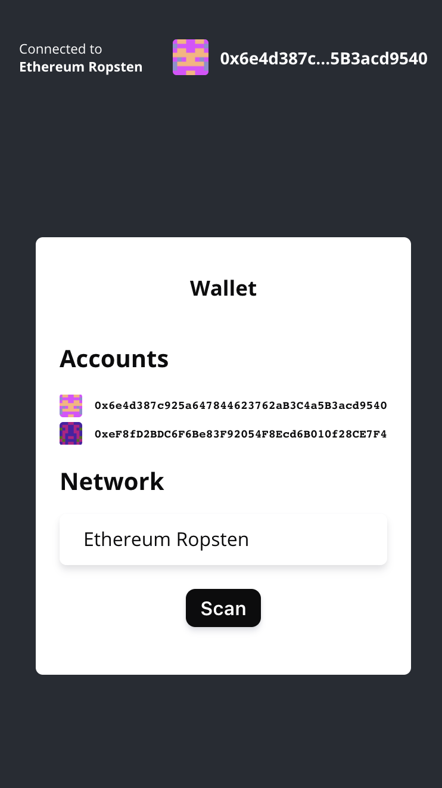
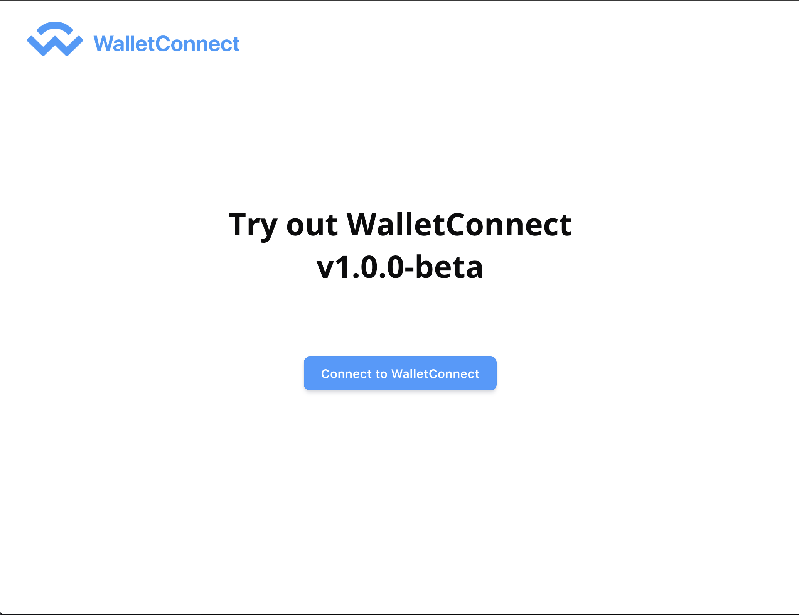

# WalletConnect v1.0.0-beta

## Introduction

WalletConnect is an open protocol to communicate securely between Wallets and Dapps \(Web3 Apps\). The protocol establishes a remote connection between two apps and/or devices using a Bridge server to relay payloads. These payloads are symmetrically encrypted through a shared key between the two peers. The connection is initiated by one peer displaying a QR Code or deep link with a standard WalletConnect URI and is established when the counter-party approves this connection request. It also includes an optional Push server to allow Native applications to notify the user of incoming payloads for establishes connections.

## Getting Started

Currently the WalletConnect protocol has references implementations written in Typescript for the Client SDK \(browser/react-native\), the Bridge Server and the Push server.

To quickly setup for your Dapp or Wallet, go to [Quick Start](quick-start.md) for code examples.

To read in more detail about the WalletConnect protocol, go to [Technical Specification](tech-spec.md)

<<<<<<< HEAD
Additionally you can also consult the API references for [Client SDK](client-sdk.md), [Bridge Server](bridge-server.md) and [Push Server](push-server.md)

## Useful Links

**Test Wallet:** [test.walletconnect.org](https://test.walletconnect.org) \([Source code](https://github.com/WalletConnect/walletconnect-mock-wallet)\)

**Example Dapp:** [example.walletconnect.org](https://example.walletconnect.org) \([Source code](https://github.com/WalletConnect/walletconnect-example-dapp)\)

=======
Additionally you can also consult the API references for [Client SDK](https://github.com/WalletConnect/walletconnect-docs/tree/cc051943791d8d5447d869cf774e4338364d883a/bridge-sdk.md), [Bridge Server](./) and [Push Server](./)
>>>>>>> c681b54eddfd40c5bffb34b95d0bc4ad3da26309

## Community

Share your experience, contribute or ask questions with the WalletConnect Community

- Github: [https://github.walletconnect.org](https://github.walletconnect.org)
- Forum: [https://discuss.walletconnect.org](https://discuss.walletconnect.org)
- Discord: [https://discord.walletconnect.org](https://discord.walletconnect.org)
- Telegram: [https://telegram.walletconnect.org](https://telegram.walletconnect.org)
- Twitter: [https://twitter.walletconnect.org](https://twitter.walletconnect.org)
