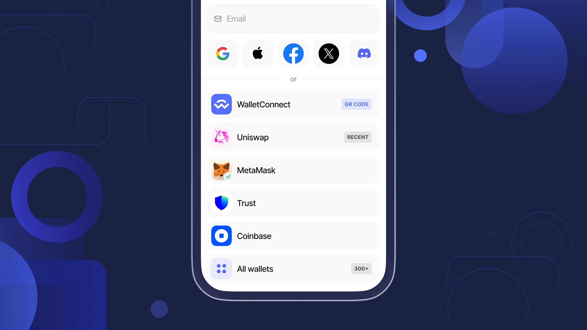

import Container from '../components/Container.js'
import Wrapper from '../components/Home/Wrapper.js'
import Button from '../components/button/index.js'
import W3MQuickStart from '../components/W3MQuickStart.js'

import reactLogo from '../../static/assets/home/reactLogo.png'
import nextjsLogo from '../../static/assets/home/nextjsLogo.png'
import htmlLogo from '../../static/assets/home/htmlLogo.png'
import vueLogo from '../../static/assets/home/vueLogo.png'
import androidLogo from '../../static/assets/home/androidLogo.png'
import iosLogo from '../../static/assets/home/iosLogo.png'
import rnLogo from '../../static/assets/home/rnLogo.png'
import flutterLogo from '../../static/assets/home/flutterLogo.png'
import unityLogo from '../../static/assets/home/unityLogo.png'
import javascriptLogo from '../../static/assets/home/javascriptLogo.png'

# AppKit

With a layered feature stack spanning onboarding to transactions, messaging and more, AppKit enables apps to build powerful top-to-bottom web3 experiences made to last, all through one seamless integration.

{/* <W3MQuickStart /> */}

## Get Started

<Wrapper
  type="large"
  fit={false}
  items={[
    {
      name: 'React',
      type: 'react',
      description: 'Get started with AppKit in React.',
      icon: reactLogo,
      href: './react/core/installation'
    },
    {
      name: 'Next.js',
      type: 'next',
      description: 'Get started with AppKit in Next.js.',
      icon: nextjsLogo,
      href: './next/core/installation',
      isWhite: true
    },
    {
      name: 'Vue',
      type: 'vue',
      description: 'Get started with AppKit in Vue.',
      icon: vueLogo,
      href: './vue/core/installation'
    },
    {
      name: 'JavaScript',
      type: 'javascript',
      description: 'Get started with AppKit in JavaScript.',
      icon: javascriptLogo,
      href: './javascript/core/installation'
    },
    {
      name: 'React Native',
      type: 'react-native',
      description: 'Get started with AppKit in React Native.',
      icon: rnLogo,
      href: './react-native/core/installation'
    },
    {
      name: 'Flutter',
      type: 'flutter',
      description: 'Get started with AppKit in Flutter.',
      icon: flutterLogo,
      href: './flutter/core/installation'
    },
    {
      name: 'Android',
      type: 'android',
      description: 'Get started with AppKit in Android.',
      icon: androidLogo,
      href: './android/core/installation'
    },
    {
      name: 'iOS',
      type: 'ios',
      description: 'Get started with AppKit in iOS.',
      icon: iosLogo,
      href: './ios/core/installation',
      isWhite: true
    },
    {
      name: 'Unity',
      type: 'unity',
      description: 'Get started with AppKit in Unity.',
      icon: unityLogo,
      href: './unity/core/installation',
      isWhite: true
    }
  ]}
/>

## Features

Some of the key features of the AppKit SDK include:

- **Support for multiple frameworks.** Easily integrate with React, Vue, Svelte, vanilla JavaScript, and more.
- **[EIP-6963.](https://eips.ethereum.org/EIPS/eip-6963) support** for browser extension wallets.
- **Email Wallets.** Allow users to seamlessly connect to dapps with their email address.
- **On-Ramp.** Enable users to buy crypto with fiat currency.
- **Customizable UI**. Choose between light and dark modes and accent colors, or even infuse it with your own branding.
- **Multi-chain ready.** Easily set up support for any EVM chain.
- **Hundreds of Wallets.** Connect with MetaMask, Rainbow, Coinbase and many more.
- **Transaction History.** View all transactions from the account view.
