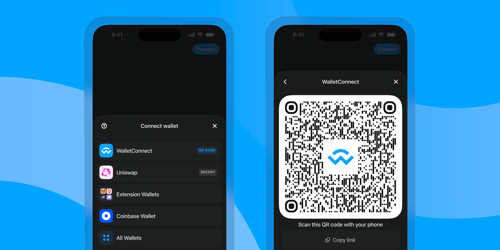

import Card from './components/GettingStarted/Card'
import Button from './components/button'

# Getting Started

<Card
  title="Web3Modal"
  description="For Dapp Developers"
  product="w3m"
  links={[
    {
      type: 'react',
      url: './web3modal/react/about'
    },
    {
      type: 'nextjs',
      url: './web3modal/nextjs/about'
    },
    {
      type: 'javascript',
      url: './web3modal/javascript/about'
    },
    {
      type: 'vue',
      url: './web3modal/vue/about'
    },
    {
      type: 'flutter',
      url: './web3modal/flutter/installation'
    },
    {
      type: 'rn',
      url: './web3modal/react-native/about'
    },
    {
      type: 'ios',
      url: './web3modal/ios/about'
    },
    {
      type: 'android',
      url: './web3modal/android/about'
    }
  ]}
  image="/assets/home/gs/w3m.png"
>
  The Web3Modal SDK allows you to easily connect your Web3 dapp with wallets. The only wallet
  connection library you'll ever need.
</Card>

<Card
  title="Web3Wallet"
  description="For Wallet Developers"
  product="w3w"
  links={[
    {
      type: 'web',
      url: './web3wallet/about?platform=web'
    },
    {
      type: 'ios',
      url: './web3wallet/about?platform=ios'
    },
    {
      type: 'android',
      url: './web3wallet/about?platform=android'
    },
    {
      type: 'flutter',
      url: './web3wallet/about?platform=flutter'
    },
    {
      type: 'rn',
      url: './web3wallet/about?platform=react-native'
    },
    {
      type: 'csharp',
      url: './web3wallet/about?platform=csharp'
    }
  ]}
  image="/assets/home/gs/w3w.png"
>
  The Web3Wallet SDK allows you to easily connect your Web3 wallet with dapps. Connecting your
  wallet has never been easier.
</Card>

<Card
  title="Web3Inbox"
  description="For Notifications"
  product="w3i"
  links={[
    {
      type: 'web',
      url: './web3inbox/about?platform=web'
    },
    {
      type: 'javascript',
      url: './web3wallet/about?platform=ios'
    }
  ]}
  image="/assets/home/gs/w3i.png"
>
  The Web3Inbox SDK provides a toolkit for integrating Web3 notification features into apps. Never
  miss a notification again.
</Card>

## What is WalletConnect?

WalletConnect is an open-source protocol that allows you to connect your mobile wallet
to different decentralized applications and other wallets. Historically this has been done through a QR code, which establishes a
secure end-to-end encrypted connection between the two devices. This allows you to interact with dapps and sign transactions securely from your mobile wallet.

WalletConnect is a protocol but we also provide a suite of SDKs to help you build your dapp or wallet.
Whether you're a dapp developer or a wallet developer, we've got you covered.

## WalletConnect SDKs

WalletConnect provides a suite of SDKs to help you build your dapp or wallet. Whether you're a dapp developer or a wallet developer, we've got you covered.

### Web3Modal

Web3Modal is a library for connecting your dapp to a user's wallet.
Web3Modal allows you to connect to a user's wallet without having to worry about the underlying protocol.

- For developers, this means you can focus on building your dapp without having to worry about wallet compatibility.
- For users, this means you can connect to your favorite wallet without having to worry about whether or not your wallet is supported.

Some of the key features of the Web3Modal SDK include:

- **Support for multiple frameworks**. Easily integrate with React, Vue, vanilla JavaScript, and more.
- **Customizable UI**. Choose between light and dark modes and accent colors, or even infuse it with your own branding.
- **EIP-6963** support for browser extension wallets.
- **Multi-chain ready**. Easily set up support for any EVM chain.
- **Hundreds of Wallets**. Connect with MetaMask, Rainbow, Coinbase and many more.
- **Transaction History**. View all transactions from the account view.

<Button name="Learn More" url="/web3modal/about" />

### Web3Wallet

The Web3Wallet SDK allows you to easily connect your Web3 wallet with dapps.
It provides a simple and intuitive interface for dapps to request actions such as signing transactions and interacting with smart contracts on the blockchain.
The SDK is designed to work with any blockchain, making it easy to support multiple chains without the need for separate integration code.

- For developers, Web3Wallet allows fine grained control over the connection process and provides a simple API for blockchain interactions.
- For users, Web3Wallet provides a simple and secure way to connect to your favorite dapps.

Some of the key features of the Web3Wallet SDK include:

- **Sign API**: Allows dapps to request that the user sign a transaction or message.
- **Auth API**: Allows dapps to verify wallet address ownership through a single signature request, realizing login in one action.
- **Chain agnostic**: The Web3Wallet SDK is designed to work with any blockchain, so you can easily support multiple chains without having to write separate integration code.

<Button name="Learn More" url="/web3wallet/about" />

### Web3Inbox

The Web3Inbox SDK provides a toolkit for integrating Web3 notification features into apps.

This SDK utilizes WalletConnect's Notify API and is designed for Web3 scenarios, providing event-based notifications for activities like DAO votes, DeFi transaction alerts, and updates for NFT holders.
Apps can send notifications to subscribed accounts, and users can receive and view their notifications in a supporting wallet, in the Web3Inbox.com app, or in the app's frontend.
Users can also discover Notify-compatible apps in their wallet or the Web3Inbox.com app to subscribe to.

- For developers, Web3Inbox provides a simple API for sending notifications to subscribed accounts.
- For users, Web3Inbox provides a simple and secure way to receive notifications from your favorite dapps.

Some of the key features of the Web3Inbox SDK include:

- **Device push notifications**: Push notifications to the user's native wallet.
- **Notifications history**: Messages are stored and can be accessed from any device.
- **Spam protection/subscription control.**

<Button name="Learn More" url="/web3inbox/about" />

## WalletConnect Cloud

[WalletConnect Cloud](https://cloud.walletconnect.com) app is exclusively for developers, and is used for project and explorer management.
It allows you to create, manage and view analytics for your projects. You can also submit your project to the WalletConnect explorer for users to discover.

## WalletConnect Explorer

[WalletConnect Explorer](https://explorer.walletconnect.com) allows users to discover and WalletConnect-enabled dapps.
For developers, [Explorer API](/cloud/explorer) currently offers the following functionality:

- **Listings** : Allows for fetching of wallets and dApps listed in the WalletConnect Cloud Explorer.
- **Logos** : Provides logo assets in different sizes for a given Cloud explorer entry.

## Advanced Usage

### Chain Onboarding

The WalletConnect protocol is multi-chain by design.
By using the [CAIP-25 standard](https://github.com/ChainAgnostic/CAIPs/blob/master/CAIPs/caip-25.md), WalletConnect aims to provide a standardized process for onboarding new chains into our ecosystem.
To get started, refer to our [Chain Onboarding Guide](/advanced/multichain/oveview).

### Providers

WalletConnect offers two types of providers for interactions: EthereumProvider and UniversalProvider.

#### EthereumProvider

EthereumProvider is a provider that is designed to work with Ethereum-compatible chains.
More information about EthereumProvider can be found [here](/advanced/providers/ethereum)

#### UniversalProvider

UniversalProvider is a provider that is designed to work with any blockchain that adheres to the [CAIP-25 Standards](https://github.com/ChainAgnostic/CAIPs/blob/master/CAIPs/caip-25.md).
More information about UniversalProvider can be found [here](/advanced/providers/universal)

### WalletConnectModal

:::info

WalletConnectModal is intended for advanced use cases. It lacks various features compared to Web3Modal like Desktop Wallet connection, EIP-6963, etc. If you are looking for a simple way to connect your dapp to a user's wallet, we recommend using [Web3Modal](/web3modal/about).

:::

WalletConnectModal is a simple UI library intended for advanced use cases where users manage connections strings and associated WalletConnect API's themselves.
It is designed to be used with EthereumProvider and UniversalProvider.
WalletConnectModal offers the following platform support:

- Web
- iOS
- Android
- Flutter
- React Native
- C#

More information about WalletConnectModal can be found [here](/advanced/walletconnectmodal/about)
