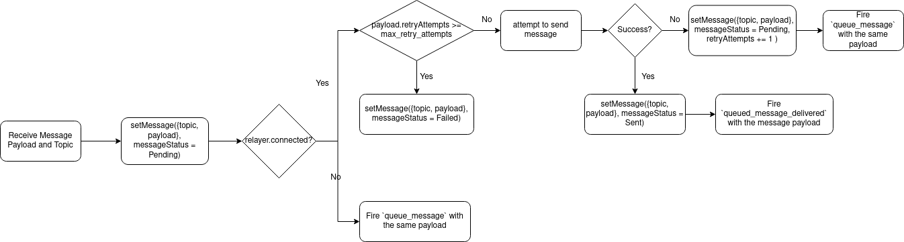

# Chat Message Queue

The chat message queue enables two things:
1. No UI blocking when sending messages
2. Smoother sending of multiple messages after one another 
3. Queueing messages for sending when connection is available, if the messages
   were sent under a spotty connection or lack thereof.

## Data fields in ChatClient 
```typescript
const max_retry_attempts: Int64 
```

## Message Function

The message function does not directly call `sendRequest` and communicate with
the relay. Instead, it'll fire an internal event: `"queue_message"`. 

The internal listener to this event will be registered during the `init` call.

## Queue_Message Listener
On receive queue message call with message payload and topic:

   
1. call `setMessage` with `MessageStatus` = `pending`
3. If `core.relayer.connected` continue, else fire `queue_message` with the 
   same payload. Do not add to retry attempts.
5. If `payload.retryAttempts` >= `max_retry_attempts`, the message's life cycle
   ends and `setMessage` is called with `MessageStatus` = `Failed`. Else,
   continue
6. Attempt to send the message using  `send_request`
7. If successful, that message's life cycle ends and `setMessage` is called with
   `MessageStatus` = `Delivered`. 
   If it fails, a `"queue_message"` event is fired once more, with the message
   payload modified to have `retryAttempts` += 1

### Diagram

   

