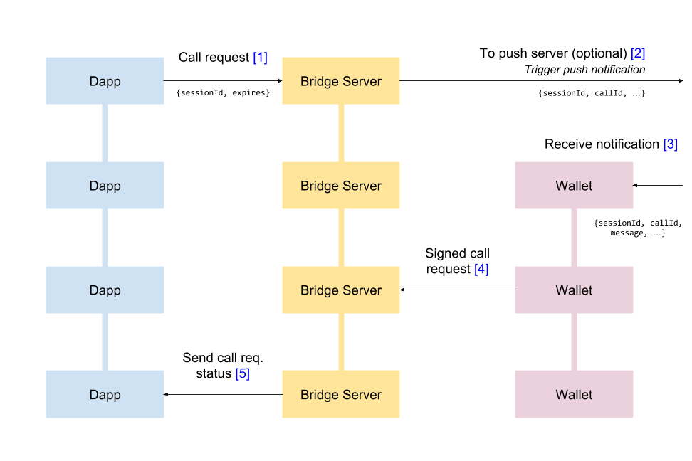

# Technical Specification

## Introduction

WalletConnect is an open protocol for connecting Dapps to Wallets. The motivation behind it came from the lack of user-friendly Wallets available to the user - In particular solutions which don't require installing browser extensions. In order to solve this it was designed to not require any additional software or hardware to connect a Wallet to a Dapp. The design is mostly tailored to mobile wallets but it could definitely support desktop wallets as well. The protocol relies that both the Dapp and the Wallet use WalletConnect Client SDK and connect to a Bridge server that will relay the communications. The communication is initiated with a standard URI format that contains the topic of the connection request, a symmetric key is then used to decrypt the payload and the bridge server url.

## Core Architecture

The architecture consists essentially of a websocket server \(Bridge\) between two peers \(Dapp and Wallet\) that use the Client SDK.

### Requesting Connection

The initiator, is the first peer who requests connection \(Dapp\). Dapp posts an encrypted payload consinsting of one-time topic \(used for handshake only\) and connection request details to the Bridge Server. Then using the WalletConnect Standard URI format \([EIP-1328](https://eips.ethereum.org/EIPS/eip-1328)\) Dapp assembles together the required parameters to establish the connection: \(handshake\) topic, bridge \(url\) and \(symmetric\) key.

```http
wc:{topic...}@{version...}?bridge={url...}&key={key...}
```

| Required parts | Notes                                                                                  |
| :------------- | :------------------------------------------------------------------------------------- |
| wc:            | Wallet Connect protocol defined in [EIP-1328](https://eips.ethereum.org/EIPS/eip-1328) |
| _topic_        | String                                                                                 |
| _version_      | Number \(eg. 1.9.0\)                                                                   |
| _bridge_       | Bridge URL \(URL Encoded\)                                                             |
| _key_          | Symmetric key hex string                                                               |

Other query string parameters are all optional.

```http
// Example URL
wc:8a5e5bdc-a0e4-4702-ba63-8f1a5655744f@1?bridge=https%3A%2F%2Fbridge.walletconnect.org&key=41791102999c339c844880b23950704cc43aa840f3739e365323cda4dfa89e7a
```

### Establishing Connection


The second peer \(Wallet\) will read the URI using either a QR Code or a deep link. After reading the URI the peer will immediately receive and decrypt the connection request payload plus post a request to exchange key which will be replaced with the new one after confirmation of the Dapp, this exchange happens in the background.

The Wallet will then display to the user request details provided by the Dapp. The user will then approve or reject the connection. If rejected, the Dapp will disconnect from the Bridge Server immediately and throw an error message if provided by the Wallet. If approved, the Dapp will receive provided account and chainId from the Wallet.

Once the connection is established, the Dapp will be able to send any JSON-RPC call requests to be handled by the Wallet either to read data from it's node or make signing requests for transactions or messages.



Additionally, there is an option from the Wallet side to subscribe for push notifications using a Push Server. This push notification subscription will be registered only when connection request has been approved by the user. This subscription can be customized with varying degrees of privacy. It can either display a generic message, include the name of the peer making the request or even display a localized message. \(read Push Notifications sections for more details\)

## Events & Payloads

There are various events that happen both internally and across peers. These events are all accompanied by a corresponding payload. The internal events are client-specific but all cross-peer events are JSON-RPC 2.0 complaint.

### Internal Events

Internal events include: `connect`, `disconnect`, `session_update` , `call_request`. The structure of the internal events are as follows:

```typescript
interface InternalEvent {
  event: string;
  params: any[];
}
```

### Cross-peer Events

Cross-peer events include: `wc_exchangeKey`,`wc_sessionRequest`, `wc_sessionUpdate`, all [Ethereum JSON-RPC requests](https://github.com/ethereum/wiki/wiki/JSON-RPC) and `eth_signTypedData` \([EIP-712](https://eips.ethereum.org/EIPS/eip-712)\)

These events are structured as JSON-RPC 2.0 requests and responses as follows:

```typescript
interface JsonRpcRequest {
  id: number;
  jsonrpc: "2.0";
  method: string;
  params: any[];
}

interface JsonRpcResponse {
  id: number;
  jsonrpc: "2.0";
  result: any;
}
```

## WalletConnect Methods

### Session Request

The first dispatched JSON RPC request is the connection request including the details of the requesting peers with the following parameters:

```typescript
interface WCSessionRequestRequest {
  id: number;
  jsonrpc: "2.0";
  method: "wc_sessionRequest";
  params: [
    {
      peerId: string;
      peerMeta: ClientMeta;
    }
  ];
}
```

The `peerId` is the sender's client id, the `peerMeta` is the sender's client metadata.

The client metadata is structured as follows:

```typescript
interface ClientMeta {
  description: string;
  url: string;
  icons: string[];
  name: string;
}
```

In browser applications, this is scraped from the loaded webpage's head meta-tags. In native applications, this is provided by the application developer.

The `wc_sessionRequest` will expect a response with the following parameters:

```typescript
interface WCSessionRequestResponse {
  id: number;
  jsonrpc: "2.0";
  result: {
    approved: boolean;
    chainId: number;
    accounts: string[];
    message: string | null;
  };
}
```

### Session Update

This JSON RPC request is dispatched by the Wallet when updating the session. This can occur either when the session is killed by the Wallet, when it provides new accounts or when it changes the active chain id. It has the following parameters:

```typescript
interface WCSessionUpdateRequest {
  id: number;
  jsonrpc: "2.0";
  method: "wc_sessionUpdate";
  params: [
    {
      approved: boolean;
      chainId: number;
      accounts: string[];
      message: string | null;
    }
  ];
}
```

### Exchange Key

This JSON RPC request is dispatched when reading the URI to secure the connection in the `wc_exchangeKey`. From browsers, this will be dispatched every-time the webpage is refreshed in order to recycle the persisted key on localStorage.

This payload has the following parameters:

```typescript
interface WCExchangeKeyRequest {
  id: number;
  jsonrpc: "2.0";
  method: "wc_exchangeKey";
  params: [
    {
      peerId: string;
      peerMeta: ClientMeta;
      nextKey: string;
    }
  ];
}
```

These parameters are similar to the `wc_sessionRequest` with the exception of the `nextKey` which is the hexadecimal string of the requested key to be exchanged.

## Cryptography

All payloads are consequently encrypted using the active symmetric key and also signed before they are posted as messages to the Bridge server.

The encryption and signing algorithms used are AES-256-CBC and HMAC-SHA256 respectively. The encryption payloads are structured as follows:

```typescript
interface EncryptionPayload {
  data: string;
  hmac: string;
  iv: string;
}
```

All fields \(data, hmac and iv\) are hexadecimal strings. The receiving peer will consequently verify the hmac before decrypting the data field using the active key and provided iv.

## WebSocket Messages

The communications are all relayed using WebSockets 'stringified' payloads with the following structure:

```typescript
interface SocketMessage {
  topic: string;
  type: string;
  payload: string;
}
```

The Bridge Server acts as pub/sub controller which guarantees published messages are always received by their subscribers.

### Subscribe

An example subscription socket message looks as follows:

```javascript
{
    topic: 'da437bf0-2783-4b64-904a-622147c895b0',
    type: 'sub',
    payload: ''
}
```

### Publish

An example published socket messages looks as follows:

```javascript
{
    topic: '4d83acea-ff18-4409-8b0c-0ad2e56846ca',
    type: 'pub',
    payload: '{"data":"821d513e79c0d5d20ca5763a7c9c9ef90399acdcc696d2057641e3fcd140db08f78bfc58f943a94af3c63d8049b42ce41d43557e0326d391e921fc90339876824ceda8793b6f673e91c20ce4d1beca79f5ebe969baddef885c15e393b7ed734b234ff291d1e2ed18cb3e3a4bef3b44a51986fcfd78f34e15db69e83ab0fcc18bb41c9dbf3d5444afa9dff7795fb709698981102bd58fc534bf4cb61167bc38477a6ff02908f3292e84cf782c8f367ae4c54dd3304403e459d56cdecadeadb84781f358d0c33862bd9df573bc5908247a","hmac":"78b397e3503175891e00da8708ab35104f0838e4910e7db5979f3c1710f98e40","iv":"12a0fbda5d7cdca8a7eaacf34055c106"}'
}
```

Additionally the Bridge Server will trigger any existing push notifications' subscriptions that listen to any incoming payloads with matching topics.

## Push Notifications

Push notification subscription is only available for native applications \(current libraries only support mobile applications\). The Push Server will require a topic, bridge url, type of notification and a token for the notification. The topic will match the client id that will receive the call requests, the bridge url is the one to subscribe to, the type of notification will differ for each mobile platform and the token is used to target the specific mobile device.

Additionally there are also options to provide a peerName of the other peer to customize the notification messages and language code \(ISO-639-1\) in order to localize push notification message content.

When registering a push notification subscription, Push Server will post a subscription request to the Bridge Server to listen for any incoming payloads matching the provided topic. It will also share a webhook to trigger the push notification.
